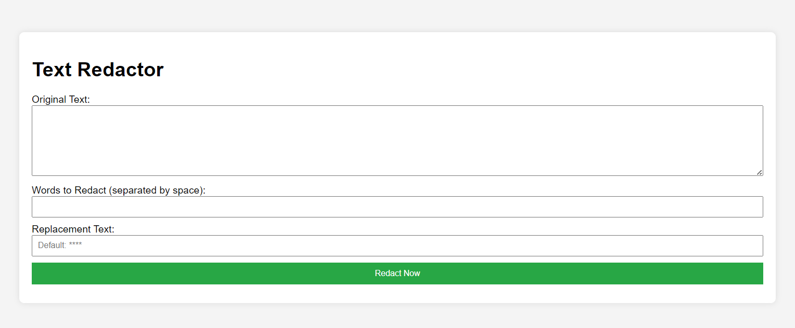

# REDACTR App

[](https://opensource.org/licenses/MIT)

## Overview

REDACTR is a web application that allows users to redact or scramble specified words in a body of text. It provides a simple and user-friendly interface for safely sharing content on social media while protecting sensitive information.

## Features

- **Word Redaction:** Users can input text and specify words (separated by space) to be redacted or scrambled.

- **Custom Replacement:** Users have the option to choose a custom replacement text for redacted words.

## Usage

1. Clone the repository:

   ```bash
   git clone https://github.com/your-username/redactr-app.git
   cd redactr-app

   ```

2. Open index.html in your web browser.

3. Enter the original text, words to redact, and any optional settings.

4. Click the "Redact Now" button to see the redacted text.

Screenshots


License
This project is licensed under the MIT License - see the LICENSE file for details.

Acknowledgments
Inspired by the need for a simple tool to redact or scramble text for social media sharing.
Feel free to contribute, report issues, or suggest improvements!
